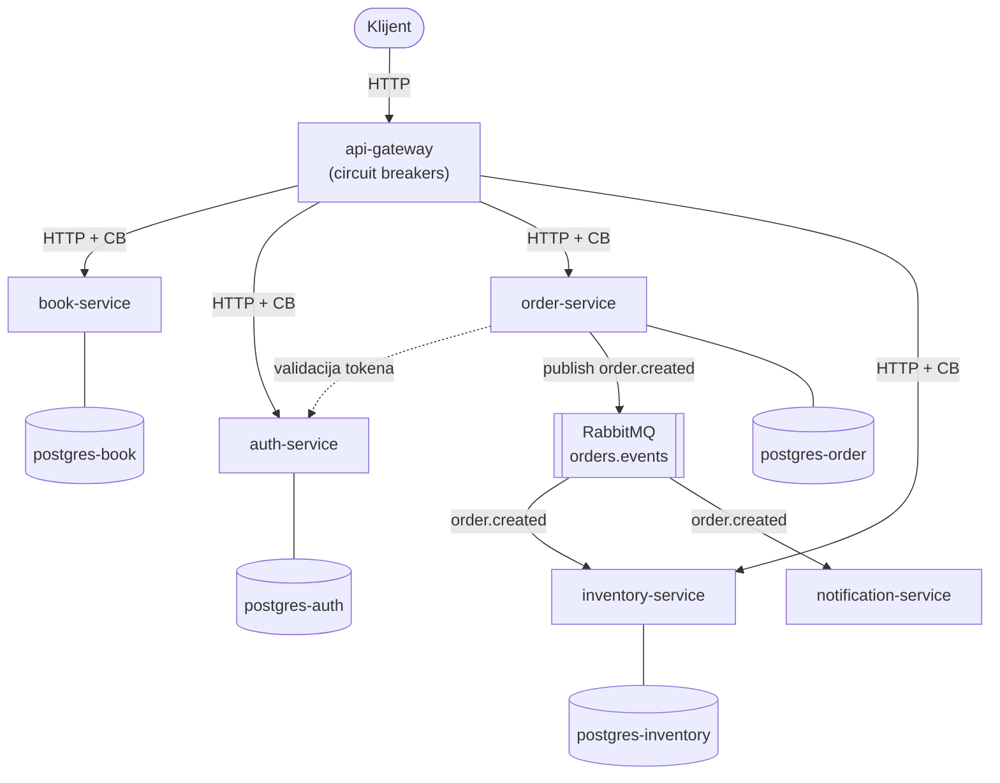

# bookstore-microservices

Event-driven mikroservisna aplikacija knjižare. 6 FastAPI servisa + React frontend, komunikacija preko REST-a i RabbitMQ event-a.

Izdvojeno iz [chaos-engineering-sandbox](https://github.com/darkobjelicic/chaos-engineering-sandbox), gde se ovaj sistem koristi kao poligon za chaos engineering eksperimente (Kubernetes, GitOps, observability, kontrolisano ubacivanje kvarova). Ovaj repo sadrži samo sâmu aplikaciju — samostalan je i pokreće se preko Docker Compose-a, bez zavisnosti od chaos-sandbox infrastrukture.

---

## Arhitektura



`order-service` publikuje `order.created` event na RabbitMQ exchange kad se porudžbina kreira. `inventory-service` i `notification-service` ga konzumiraju asinhrono (event-driven, ne sinhroni REST poziv) — otuda EDA deo arhitekture.

## Servisi

| Servis | Port | Opis |
|---|---|---|
| api-gateway | 8000 | Ulazna tačka, rutira ka ostalim servisima, circuit breaker-i |
| auth-service | 8001 | Registracija/login, izdaje JWT |
| book-service | 8002 | Katalog knjiga |
| inventory-service | 8003 | Stanje zaliha, konzumira `order.created` |
| order-service | 8004 | Kreiranje porudžbina, publikuje `order.created` |
| notification-service | 8005 | Konzumira `order.created`, šalje notifikacije |
| frontend | 3000 | React UI |
| adminer | 8081 | Web UI za Postgres baze |

## Stack

FastAPI, SQLModel, React, PostgreSQL, RabbitMQ, Docker / Docker Compose.

---

## Pokretanje lokalno

```bash
cp .env.example .env   # popuniti vrednosti
make dev-up            # docker compose up --build -d
```

Gateway je dostupan na `http://localhost:8000`, frontend na `http://localhost:3000`.

```bash
make dev-logs   # prati logove svih servisa
make dev-down   # gasi i briše volumene
```

## Code quality

```bash
make lint-install   # jednom, instalira pre-commit hookove
make lint            # black, hadolint, yamllint, osnovne provere
```

## CI/CD

- `ci.yml` — lint, bezbednosni sken (bandit, trivy), build + sken svake slike na svaki PR
- `cd.yml` — na push u `main`, build i push slika na Docker Hub (`darko999/*`, tagovane sa `latest` i kratkim SHA-om)

Slike odavde koristi [chaos-engineering-sandbox](https://github.com/darkobjelicic/chaos-engineering-sandbox) za deploy na Kubernetes.
